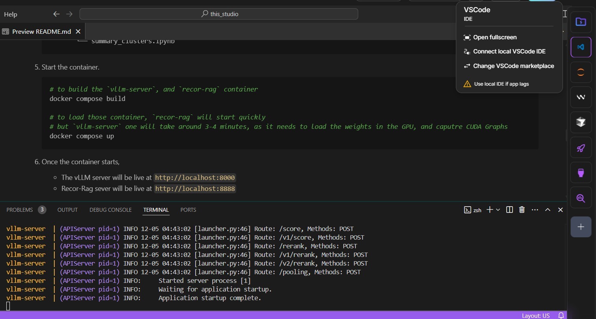
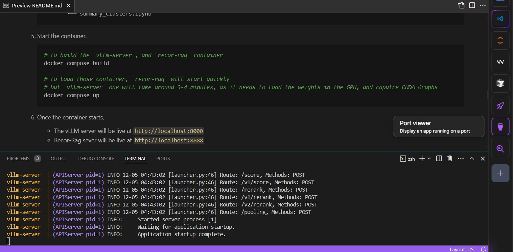
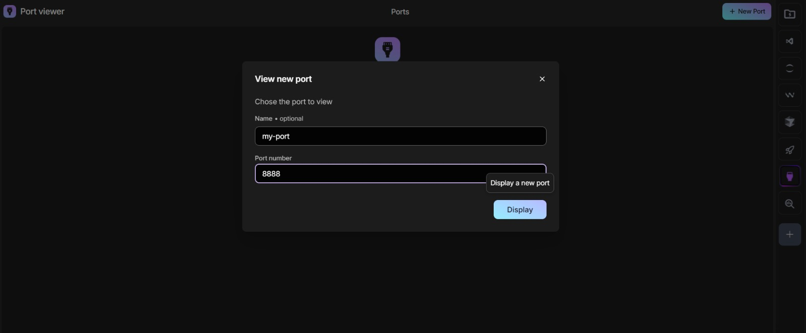
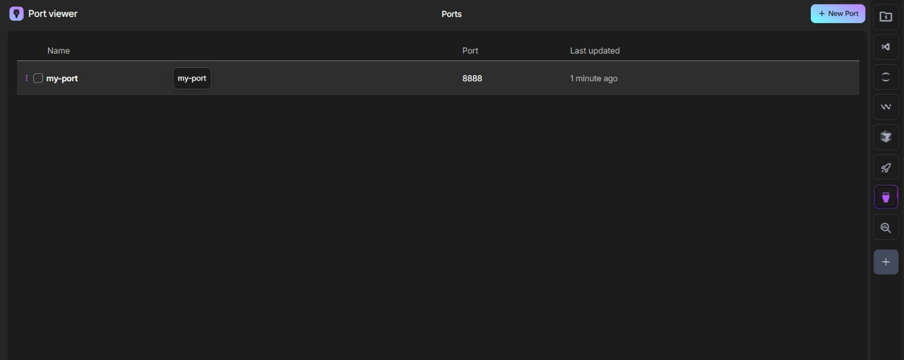
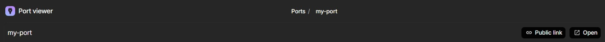
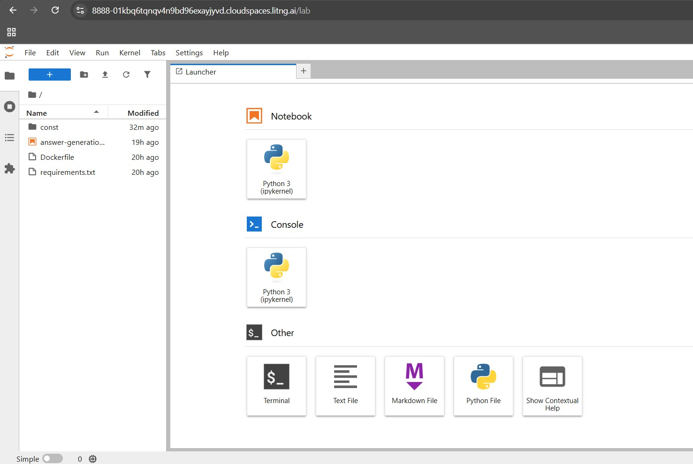

<h1 align="center">ReCOR RAG</h1>

## Folder Structure

1. `./technical-report`
    - It contains `Technical_Report.pdf`
    - Kindly download for better readability.

2. `./queries-generation`
    - It generate queries and answer, with three methods.
    - **method-1**: transcript agnostic, using domain, intent, mece-category and sub-category.
    - **method-2**: transcript agnostic, using Self-Instruct and Auto-Evol instruct.
    - **method-3**: with raw transcripts.

3. `./simulated-real-query-system`
    - Curated dataset of more than 70 queries.
    - ****task-1-queries.xlsx****, and ****task-2-queries.xlsx****.
    - Kindly download both the files for better readability.

4. `./recor-rag` (dockerized)
    - Dockerized Jupyter Notebook for `final query answer generation` for task 1 and task 2.
    - Below are the step to re-produce this.

<br />

<h1 align="center">Running ReCOR-RAG</h1>

## Lightning.ai Account Creation

1. Create account in [https://lightning.ai](https://lightning.ai).

    - it has all the requirements needed to run the docker file.
    - you need an email, and phone number (no credit/debit card needed).

2. After creating an account, open [https://lightning.ai](https://lightning.ai) and click on `+ new studio` button on the top right corner.
3. In the **machine type** select `GPU`, then `L40S`, also make sure `Interruptible` is toggled off. (If you've already started the studio with `CPU`, then change to `GPU` from top right corner)
4. Now confirm and start.

## Step for re-producing the proposed solution

1. Upload the zip-file provided with this readme (or run the below command if the zip file does not work) on lightning.ai instance just created.

    ```bash
    # or if you prefer to download using wget
    wget https://storage.googleapis.com/recor-rag/team_65.zip
    ```

2. Unzip the file by running the following commands

    ```bash
    sudo apt update
    sudo apt install -y unzip
    unzip team_65.zip
    ```

3. Run the followings commands to download the models

    ```bash
    # 1. dowload openai/gpt-oss-20b model (~41 GB)
    gsutil -m cp -r gs://recor-rag/model-gptoss .

    # 2. dowload colbert, and embeddings model (~3 GB)
    gsutil -m cp -r gs://recor-rag/huggingface .
    ```

4. Current directory should look like this

    ```bash
    .
    ├── .gitignore
    ├── README.md
    ├── docker-compose.yml
    ├── images/*
    ├── queries-generation
    │   ├── method-1
    │   │   ├── query-evaluation
    │   │   │   ├── README.md
    │   │   │   ├── llm-as-a-judge-task-1.ipynb
    │   │   │   ├── llm-as-a-judge-task-2.ipynb
    │   │   │   ├── llm-eval-stage-1.ipynb
    │   │   │   ├── non-llm-eval-task-1.ipynb
    │   │   │   ├── non-llm-eval-task-2.ipynb
    │   │   │   ├── test1.json
    │   │   │   └── test2.json
    │   │   └── query-generation
    │   │       ├── README.md
    │   │       └── query-generator-task-1-2.ipynb
    │   ├── method-2
    │   │   ├── README.md
    │   │   ├── auto_evol.py
    │   │   ├── config.py
    │   │   ├── main.py
    │   │   ├── requirements.txt
    │   │   ├── seed_generator.py
    │   │   ├── self_instruct.py
    │   │   └── utils
    │   │       ├── failure_detector.py
    │   │       ├── init.py
    │   │       ├── llm_client.py
    │   │       └── prompts.py
    │   └── method-3
    │       ├── README.md
    │       ├── dataset-generation-part-1.ipynb
    │       ├── dataset-generation-pipeline.ipynb
    │       ├── final-transcripts-domain-corrected.json
    │       ├── images/*
    │       ├── requirements.txt
    │       └── summary_clusters.ipynb
    ├── recor-rag
    │   ├── Dockerfile
    │   ├── answer-generation.ipynb
    │   ├── const
    │   │   ├── faiss_index
    │   │   │   ├── index.faiss
    │   │   │   └── index.pkl
    │   │   └── summaries-20k.json
    │   └── requirements.txt
    ├── simulated-real-query-system
    │   ├── task-1-queries.xlsx
    │   └── task-2-queries.xlsx
    └── technical-report
        └── Technical_Report.pdf
    ```

5. Start the container.

    ```bash
    # to build the `vllm-server`, and `recor-rag` container
    docker compose build

    # to load those container, `recor-rag` will start quickly
    # but `vllm-server` one will take around 3-4 minutes, as it needs to load the weights in the GPU, and caputre CUDA Graphs
    docker compose up
    ```

6. Once the container starts,

    - The vLLM server will be live at `http://localhost:8000`
    - Recor-Rag sever will be live at `http://localhost:8888`

7. To open the jupyter notebook,

    - Right now you are here at `VSCode`. To return to this readme at any point in time, click on this icon.
      

    - To open jupyter notebook, we need to forward port.
    - On the right side bar, click `Port Viewer`
      
    - Click on `+ new port`
    - Enter port number as `8888` and any name of your choice.
    - Click display.
      
    - Click on the port you named (eg. here it's `my-port`).
      
    - Copy the `Public Link`, And open in new tab.
      

8. Open jupyter notebook (in the public link)
    - It should look like this.
      
    - In the jupyter notebook double click on this `answer-generation.ipynb` at left side to open the file.
    - Now run each cell of the notebook to see ReCOR RAG at work, and the response and corresponding evidence pertaining to a dataset query.


---

- All the images above are from `https://lightning.ai`.